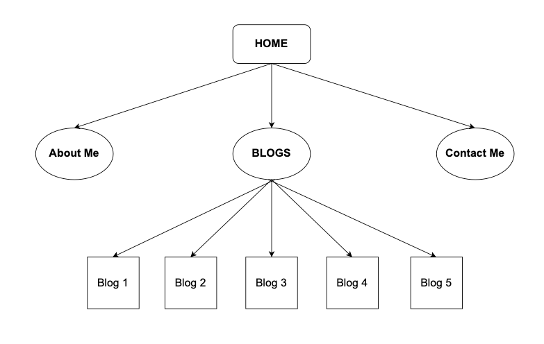

# Tim Portfolio Readme dcoument

URL link to published portfolio website
https://timportfolio-assessment.netlify.app/

Link to my Github repo
https://github.com/Sky12072/portfolio-assessment

Purpose of website
To communicate information about me and demonstrate my coding abilities to prospective employers. 

Functionality 
Navbar
Footnote
5 blog cards
contact form
back to top button
find out more about me button
Download resume button
Follow my projects button

Sitemap

Screenshots
All the screenshots are for desktop screen size. All other sizes including tables and mobile screens are available in this folder.

Target Audience
Employer looking to engage a dev and/or IT professional. 

Tech stack
HTML
CSS
Javascript
Github
Netlify