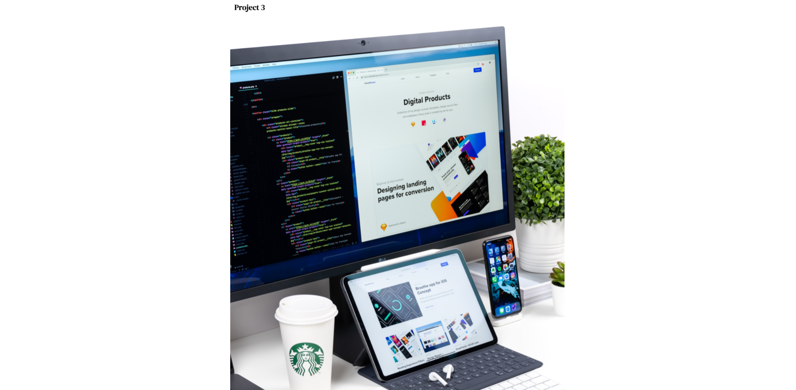
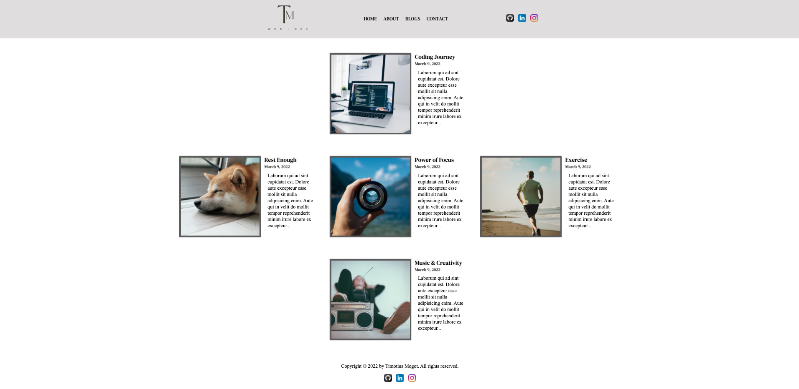
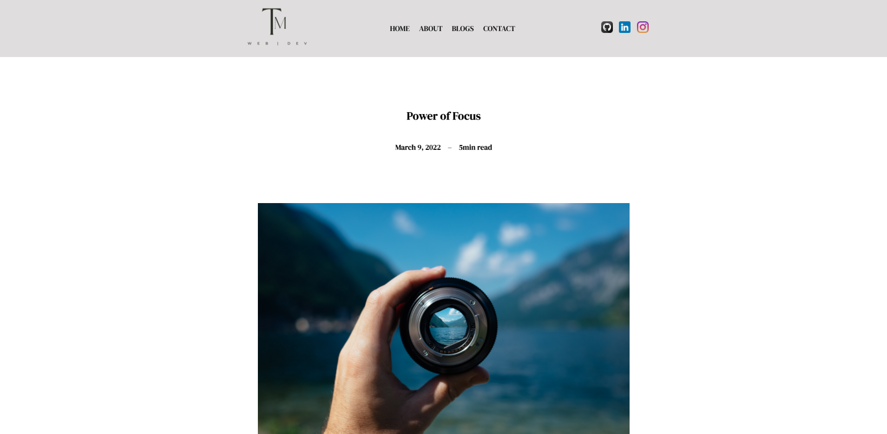

# **Tim Portfolio Readme document**

#### **URL link to published portfolio website**
[https://timportfolio-assessment.netlify.app/](https://timportfolio-assessment.netlify.app/)

#### **Link to my Github repo**
[https://github.com/Sky12072/portfolio-assessment](https://github.com/Sky12072/portfolio-assessment)

#### **Purpose of website:** to communicate information about me and demonstrate my coding abilities to prospective employers. 

#### **Functionality**
1. Navbar (desktop and mobile)
2. Footnote
3. 5 blog cards
4. Contact form
5. Back to top button
6. Find out more about me button
7. Download resume button
8. Follow my projects button

#### **Sitemap**

#### **Web Screenshots**
All the screenshots are for desktop screen size. All other sizes including tablets and mobile screens are available in images->webpage-screenshots folder.

##### Homepage

##### About me page

##### Blogs page

##### Contact page

##### One of blog articles page

#### **Target Audience:**
Employer looking to engage a dev and/or IT professional. 

#### **Tech stack:**
1. HTML
2. CSS
3. Javascript
4. Github
5. Netlify